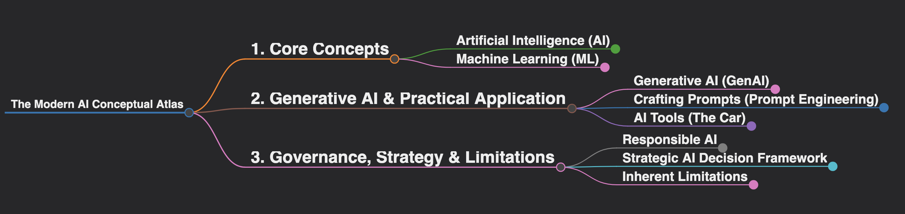
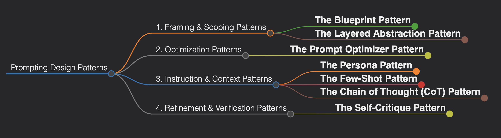

# The AI Core Concepts Atlas

### Introduction
Navigating the world of Artificial Intelligence requires a clear map. This repository serves as a **Conceptual Atlas** to the modern AI landscape, designed as a quick-reference visual guide.

This atlas prioritizes clarity and the **connections between ideas**. Each map is an interactive artifact that consolidates the key components of a major domain within AI, providing a high-level understanding of how everything fits together.

---

### The Mindmap Collection

#### **1. The Modern AI Landscape**
This mindmap covers the foundational pillars of AI, from Machine Learning paradigms to the principles of Responsible AI.

  <em>Click the image above to explore the full interactive mindmap.</em>

#### **2. The Prompt Engineering Design Patterns**
This mindmap visualizes a strategic framework for collaborating effectively with Large Language Models.

  <em>Click the image above to explore the full interactive mindmap.</em>

*(More maps will be added here as new domains are explored.)*

---

*This project is one of several in my **Strategic AI Portfolio**. Each project documents a different aspect of my journey in AI strategy.*
